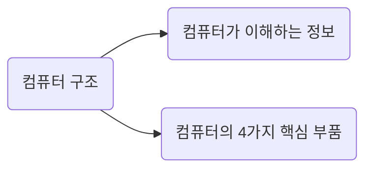
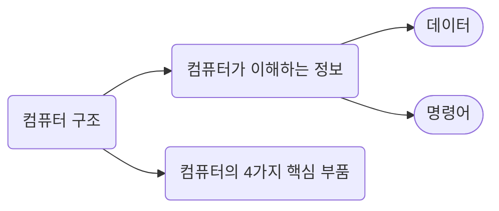
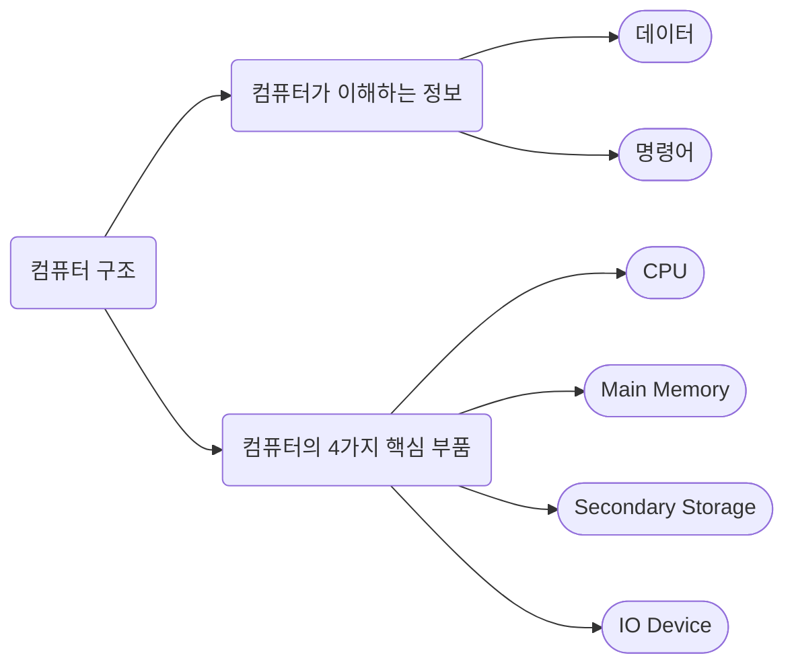
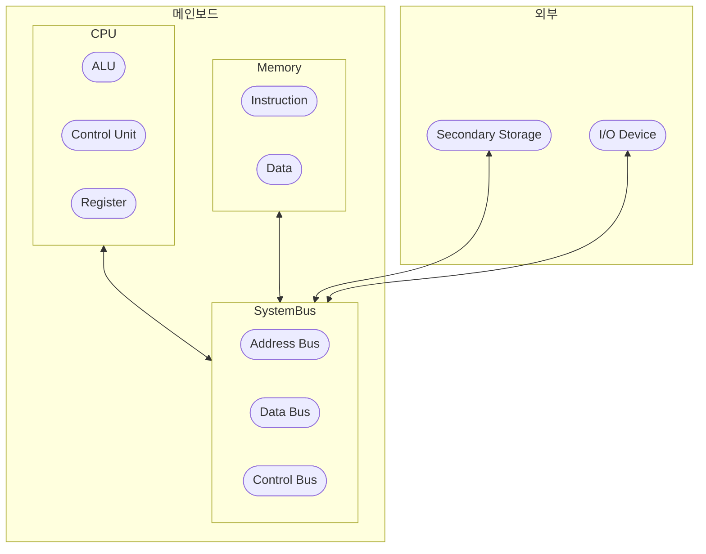

# Computer Architecture Overview

컴퓨터 구조에서 알아야 할 지식은 크게 다음과 같은 2가지다.
- **`컴퓨터가 이해하는 정보`**
- **`컴퓨터의 4가지 핵심 부품`**

 

## 1. 컴퓨터가 이해하는 정보

- 컴퓨터는 0과 1로 표현된 이진수 정보만을 활용
- 이러한 이진수 정보의 종류로는 **`데이터(Data)`** 와 **`명령어(Instruction)`** 가 존재  

> **`데이터(Data)`**  
> - 컴퓨터가 이해하는 숫자, 문자, 이미지, 동영상과 같은 정적인 정보  
> - 컴퓨터와 주고받는 정보나 컴퓨터에 저장된 정보를 가리킬 때에도 편하게 통칭하여 사용하기도 함  

> **`명령어(Instruction)`**  
> - 데이터를 조작하고 컴퓨터를 작동시키는 일련의 정보
> - 컴퓨터 시스템를 실질적으로 작동시키는 중요한 역할  

 

## 2. 컴퓨터의 4가지 핵심 부품

세상에는 다양한 형태로 컴퓨터가 존재하지만 그 핵심 부품은 크게 다르지 않으며, 일반적으로 다음과 같다.
- **`중앙처리장치(CPU, Central Processing Unit)`**
- **`주기억장치(Main memory)`**
	- RAM(Random Access Memory), ROM(Read Only Memory)
- **`보조기억장치(Secondary storage)`**
	- HDD, SSD
- **`입출력장치(IO, Input/Output Device)`**  
	- Keyboard, Mouse, Monitor, Speaker, Print, ...

- 이러한 핵심 부품들은 **`메인 보드(Main Board)`** 라는 판 내에 장착되어 있음
- 메인 보드 내의 **`시스템 버스(System Bus)`** 라는 길을 통해, 부품끼리 서로 통신하는 구조  

   

 

### 메모리(Memory)

- 현재 실행되는 프로그램의 **명령어**와 **데이터**를 저장하는 부품
- 프로그램이 실행되기 위해선(프로세스가 되기 위해선), 반드시 메모리에 올라와야 함
- 메모리에 저장된 값에 빠르고 효율적으로 접근하기 위해 **`주소(Address)`** 개념을 사용
- 휘발성이라 전기 공급이 끊기면, 저장된 정보들이 다 날아감

### CPU

- 메모리에 저장된 명령어를 읽어 해석하고 실행하는 부품으로, **컴퓨터의 두뇌** 역할을 함
- CPU 내부에는 다음과 같은 3가지 핵심 구성 요소들이 존재 

> **`산술논리연산장치(ALU, Arithmetic Logic Unit)`**  
> 
> 계산만을 도맡아 진행하는 부품  

> **`레지스터(Register)`**  
> 
>  필요한 값들을 임시로 저장하는 작은 저장 장치로, CPU 내부에 각기 다른 이름과 역할을 지닌 레지스터가 여러 개 존재  

> **`제어장치(Control Unit)`**  
> 
> `제어 신호(Control Signal)`라는 전기 신호를 내보내고 명령어를 해석하는 장치.  
> 제어 신호는 컴퓨터 부품들을 관리하고 작동시키기 위한 일종의 전기 신호.  

 

### 보조기억장치(Secondary Storage)

- 비휘발성 메모리로, 전기가 공급되지 않아도 영구적으로 데이터 저장이 가능한 부품
- HDD, SSD, USB, DVD, CD-ROM이 대표적
- 메모리보다 가격은 싸나, 속도가 느림

### 입출력 장치(IO Device)

- 컴퓨터 외부에 연결되어, 컴퓨터 내부와 정보를 교환할 수 있는 부품
- 마이크, 스피커, 모니터, 프린터, 마우스, 키보드 등이 대표적
- 관점에 따라서는 보조기억장치 또한 입출력 장치로 볼 수 있으므로, 이 둘을 묶어 **`주변장치(Peripheral Device)`** 라고 통칭하기도 함

### 메인보드(Main Board)

- 컴퓨터의 핵심 부품들이 연결된 판으로, **`마더보드(Mother Board)`** 라고도 불림
- 여러 컴퓨터 부품을 부착할 수 있는 슬롯과 연결 단자가 존재
- 메인 보드에 연결된 부품들은 메인 보드 내부의 **`버스(Bus)`** 라는 통로를 통해, 서로 통신

### 시스템 버스(System Bus)

- 다양한 버스 통로 중, **컴퓨터의 4가지 핵심 부품을 연결하는 가장 중요한 버스**가 바로 **`시스템 버스(System Bus)`**
- 시스템 버스는 **`주소 버스(Address bus)`** , **`데이터 버스(Data bus)`** , **`제어 버스(Control bus)`** 로 나뉘어짐

> **`주소 버스(Address Bus)`**  
> 
> 메모리에 접근할 주소값을 주고받는 통로  

> **`데이터 버스(Data Bus)`**  
> 
> 명령어와 데이터를 주고받는 통로  

> **`제어 버스(Control Bus)`**  
> 
> 제어 신호를 주고받는 통로  

 

## 3. 요약

위에서 봤던 개념들을 전체적인 그림으로 그려보자면, 다음과 같다.  

