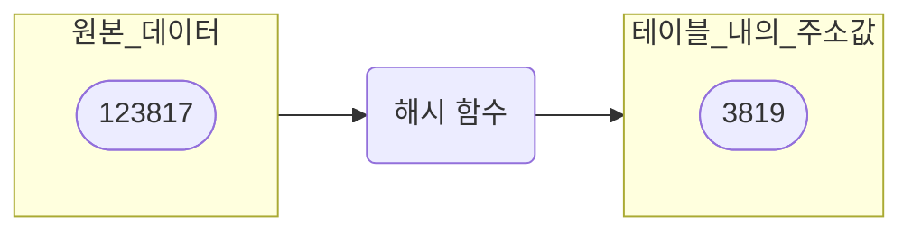

# 1. 해시 테이블(Hash Table)이란?

- 입력 받은 데이터를 변환하여 만든 고유한 값을 **`해시값`** 이라고 함
- 이 해시값을 테이블 내의 주소로 활용하는 자료구조가 **`해시 테이블(Hash Table)`**



<br>

- **`원본 데이터`** 와 **`해시값(테이블 내의 주소값)`** 을 활용하여 다음과 같이, 배열에 저장하는 방식

```cpp
HashTable[3819] = 123817;
```  

- 즉, 해시 테이블의 동작 과정을 정리해보면 다음과 같다.
	1. 데이터를 담을 테이블을 미리 크게 확보
	2. 입력 받은 데이터를 해싱하여, 테이블 내의 주소를 계산
	3. 계산한 주소를 통해 테이블에 접근하여 원본 데이터를 저장

### 해시 테이블의 특징

- 해싱을 통해 주소값을 얻는 과정은 상수 시간에 완료되므로, 테이블의 크기에 따른 성능 변화 X
- 해시값을 통해 원하는 데이터를 $\mathrm{O(1)}$ 만에 찾을 수 있으므로 강력한 탐색 성능을 자랑
	- 하지만 다른 데이터와 해시값이 같아 충돌하게 되면, 성능 하락
- 테이블 내의 빈 공간이 많아야 해시 성능이 유지될 수 있으므로, 메모리를 많이 사용함

<br>

# 2. 해시 함수(Hash Function)

- 해시 테이블의 강력한 성능을 위한, 제일 중요한 요소
- 다른 데이터와 겹치지 않는 고유한 값을 빠르게 도출해낼 수 있어야 함
- 해시 함수의 계산 방법으로는 대표적으로 다음과 같은 방법들이 존재

### 나눗셈법(Division Method)

- 가장 간단한 알고리즘으로, 입력 값을 테이블의 크기로 나눈 나머지를 주소로 사용하는 방식
- 테이블 내 공간을 효율적으로 사용하기 위해선, 테이블의 크기가 소수인 것이 좋음
	- 특히 제곱수와 거리가 먼 소수를 사용할 경우, 좋은 성능을 보여줌
- 하지만 서로 다른 입력 값에 대해 동일한 주소를 반환할 확률이 높아, **`충돌(Collsion)`** 이 발생할 확률이 높음
- 또한, 해시 테이블 내 일부 지역의 주소들을 집중적으로 반환하기에, 데이터가 한 곳에 모이는 **`클러스터(Cluster)`** 가 발생할 가능성이 높음

### 자릿수 접기

- 종이를 접듯이 숫자를 접어, 일정한 크기 이하의 수로 만드는 방법
- 좀 더 명확히 말하자면, **`주어진 숫자의 각 자릿수를 더해 해시값을 만드는 방법`**
- 예를 들어 "8129335"와 같은 7자리 숫자가 있다면, 각 자리의 수를 모두 더함
```cpp
8 + 1 + 2 + 9 + 3 + 3 + 5 = 31
```  

- 두 자리씩 더할 수도 있음
```cpp
81 + 29 + 33 + 5 = 148
```  

- 자릿수 접기 방법 역시, 나눗셈법처럼 일정한 범위 내의 해시값을 생성하는 게 가능
	- 10 진수의 경우, 각 자리마다 0 ~ 9까지의 값을 가질 수 있음
	- 만약 7자리수에 대해 한 자리씩 접기를 하면 0 ~ 63까지의 해시값 생성이 가능
	- 두 자리씩 접기를 하면 0 ~ 306까지의 해시값 생성이 가능
- 이러한 특성 때문에, **`문자열을 키로 사용하는 해시 테이블`** 에 잘 어울림
	- 문자열의 각 요소를 ASCII 코드로 번호로 바꾸고, 이 값들을 각각 자릿수 접기를 하면 됨

<br>

# 3. 해시 충돌(Hash Collision)

- 고유한 해시값만 완벽하게 만들어 내는 해시 함수 알고리즘은 존재하지 않음
- 서로 다른 데이터의 해시값이 같은 현상을 **`충돌(Collision)`** 이 일어났다고 이야기 함
- 이러한 충돌을 해결해주기 위한 조치로는 크게 2가지 방법이 존재
	1. 해시 테이블의 주소 바깥에 새로운 공간을 할당 ( **`Open Hashing`** )
	2. 처음에 주어진 해시 테이블 공간 안에서 문제를 해결 ( **`Closed Hashing`** )

## 1) 체이닝(Chaining)

  

[출처 : 덕's IT Story](https://itstory.tk/entry/%ED%95%B4%EC%8A%81%EC%97%90%EC%84%9C%EC%9D%98-%EC%B6%A9%EB%8F%99%ED%95%B4%EA%B2%B0Collision-Resolution) 

- 각 데이터를 해당 주소에 있는 연결 리스트에 삽입하여 문제를 해결하는 기법
- 체이닝 기반 해시 테이블은 데이터 대신, 연결 리스트에 대한 포인터를 관리
- 이러한 형태의 해시 테이블은 탐색과 삽입 연산에서 변경이 필요

> **탐색 연산**  
> 
> 1. 찾고자 하는 목표값을 해싱하여 연결 리스트가 저장된 주소를 찾는다.  
> 2. 이 주소를 이용하여 해시 테이블에 저장된 연결 리스트에 대한 포인터를 생성  
> 3. 연결 리스트의 앞에서부터 차례대로 이동하며, 목표값이 저장되어 있는지 비교  
> 	- 목표값과 연결 리스트 내 노드값이 일치하면, 해당 노드의 주소 반환   

```cpp
// 슈도 코드입니다.

ValueType Find(KeyType key)
{
	// 1. 주소 해싱
	int address = HashFunction(key);
	Node* linkedList = hashTable[address];

	if (linkedList == nullptr)
		return nullptr;

	// 2. 연결 리스트를 타고 들어가며 목표값 찾기
	while (linkedList->next != nullptr)
	{
		if (linkedList->key == key)
			return linkedList->Value;
		linkedList = linkedList->next;
	}

	return nullptr;
}
```  

<br>

> **삽입 연산**
>   
> 1. 해시 함수를 통해, 데이터가 삽입될 연결 리스트의 주소를 얻는다.  
> 2. 연결 리스트가 비어 있으면 데이터를 바로 삽입한다.  
> 	- 비어 있지 않다면, 연결 리스트의 헤드 노드 앞에 데이터를 삽입  
> 	- 테일 노드에 삽입하면 순차 탐색을 해야 하므로 손해  

```cpp
// 슈도 코드입니다.

void Insert(KeyType key, ValueType value)
{
	// 1. 주소 해싱
	int address = HashFunction(key);
	Node* newNode = new Node(key, value);

	// 2. 비어 있으면 데이터 바로 삽입
	if (hashTable[address] == nullptr)
	{
		hashTable[address] = newNode;
		return;
	}

	// 3. 아니라면, 헤드 노드 앞에 삽입
	Node* headNode = hashTable[address];
	newNode->next = headNode;
	hashTable[address] = headNode;
}
```  

#### 체이닝 기법의 성능 향상 방법

- 연결 리스트를 사용할 경우, 순차 탐색을 해야 하기에 성능이 나빠질 수 있음
- 해시 함수의 성능이 좋지 않아 충돌이 자주 일어난다면, 연결 리스트 대신 레드 블랙 트리와 같은 이진 탐색 트리를 사용하는 것이 효율적

<br>

## 2) 개방 주소법(Open Addressing)

- 충돌이 발생했을 때, 해시 함수에 의해 만들어진 주소가 아닌 다른 주소를 사용하도록 허용하여 해결하는 알고리즘
- 충돌이 발생하면, 개방 주소법은 해시 테이블 내의 새로운 주소를 탐사하여 충돌된 데이터를 입력하는 방식으로 동작
- 개방 주소법은 탐사 방법에 따라, 다음과 같이 여러 종류가 나뉘어짐


### 선형 탐사(Linear Probing)

- 가장 간단한 탐사 방법으로, 현재 주소에서 고정 폭만큼 다음 주소로 이동하는 방법
- 고정 폭만큼 계속 이동하다가 비어 있는 주소를 발견하면, 그곳에 데이터를 입력
- 충돌할 뻔한 데이터들이 한 곳에 모이는 **`클러스터(Cluster)`** 현상이 많이 발생
	- 클러스터 현상이 발생하면, 탐사 성능이 급격히 저하됨
	- 이를 개선하여 만든 알고리즘이 **`제곱 탐사(Quadratic Probing)`**  

### 제곱 탐사(Quadratic Probing)

- 선형 탐사와 비슷하나, 이동폭이 제곱수로 늘어나는 것이 차이점
- 하지만 제곱수의 폭으로 이동한다는 규칙이 있기에, 클러스터 현상을 예방할 수 없음
- 하나의 주소에서 충돌이 발생할 때, 탐사할 위치가 정해져 있기 때문에 발생하는 문제
- 이러한 문제를 해결하려면, 탐사할 새로운 주소에 대한 규칙성을 제거하는 것이 필요
	- 이를 위한 방법이 **`이중 해싱(Double Hashing)`**  

### 이중 해싱(Double Hashing)

- 최초의 주소를 얻을 때, 충돌이 일어날 때 탐사 이동폭을 얻기 위한 2가지 함수를 준비
- 이러한 방식이면 규칙성을 없앨 수 있음
- 하지만, 해시 테이블의 남은 공간이 거의 없을 때에는 성능이 하락
	- 이 경우에는 **`재해싱(Rehashing)`** 이 필요

### 재해싱(Rehashing)

- 해시 테이블의 크기를 늘리고, 늘어난 해시 테이블의 크기에 맞춰, 테이블 내의 모든 데이터를 다시 해싱하는 작업
- 통계적으로 해시 테이블의 공간 사용률이 70 ~ 80%에 이르면 성능 저하가 나타나기 시작
- 그러므로, 공간 사용률이 이보다 적은 수준일 때 미리 재해싱을 해둬야 성능 저하를 예방
- 하지만, 재해싱 작업 역시 만만치 않게 무거운 작업
	- 임계치를 너무 낮추면 오버헤드가 많이 발생할 것이므로, 임계치를 대략 75% 수준으로 설정하는 것이 일반적