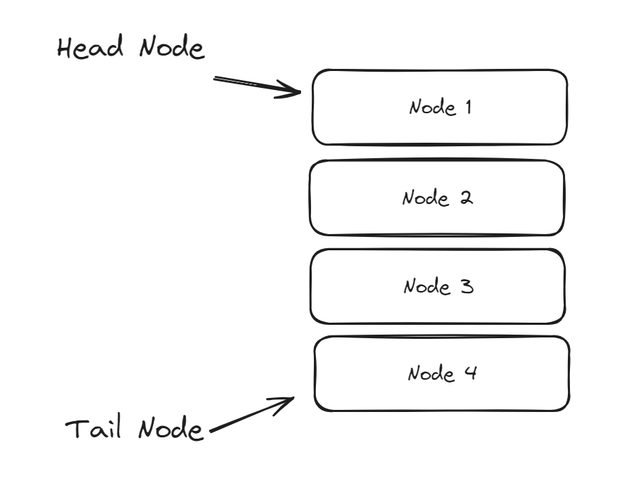

## 1. 리스트(List)의 개념

 
- **`노드(Node)`** 라고 불리는 일련의 데이터 저장 단위 목록으로 이루어진 자료구조
- 리스트의 노드 목록에서 첫 번째 노드를 **`헤드(Head)`** , 마지막 노드를 **`테일(Tail)`** 이라고 부름
- **`리스트의 길이`** 는 헤드부터 테일까지의 노드 개수

### 리스트를 사용하기 좋은 상황
- 입력 데이터의 개수를 사전에 예측하기 어려운 경우
- 데이터의 삽입/삭제가 빈번히 일어나는 경우
 

## 2. 리스트의 종류
### 1) 단일 연결 리스트(Singly Linked List)

  
- **`데이터를 보관하는 필드`** 와 **`다음 노드를 가리키는 포인터`** 로 이루어짐
- 헤드에서 테일 방향으로 한 줄로 연결되어 있는 구조

### 2) 이중 연결 리스트(Double Linked List)

  

- 다음 노드에 대한 포인터만 있었던 단일 연결 리스트와 달리, 이전 노드에 대한 포인터까지 **양방향 접근이 가능한 연결 리스트**
- 단방향 탐색만 가능했던 단일 연결 리스트 구조를 개선해, **양방향 탐색이 가능**한 것이 특징

### 3) 환형 연결 리스트(Circular Linked List)

  

- 단일 연결 리스트에서 테일 노드의 포인터가 NULL이 아닌, 헤드 노드를 가리키는 구조
- 이중 연결 리스트에서 헤드의 이전 포인터는 테일, 테일의 다음 포인터는 헤드로 지정하여 구현할 수도 있음
- 테일 노드에 접근하는 성능이 대폭 향상됨
 

## 3. 리스트의 장단점 및 성능

### 장점
- 링크 방식으로 데이터를 추가하기에, 입력 데이터의 크기를 사전에 몰라도 됨
- 데이터의 추가/삽입/삭제 연산이 용이

### 단점
- 다음 노드를 가리키는 포인터에 대한 추가적인 메모리(4 or 8 byte) 필요
- 선형 탐색($\mathrm{O(N)}$) 이기에, 특정 노드를 찾는 데에 오래 걸림
	- 배열처럼 Random Access를 지원하지 않음

### 시간 복잡도
| 연산       | 시간 복잡도     |
| ---------- | --------------- |
| **`접근`** | $\mathrm{O(N)}$ |
| **`탐색`** | $\mathrm{O(N)}$ |
| **`삽입`** | $\mathrm{O(1)}$ |
| **`삭제`** | $\mathrm{O(1)}$ |  
